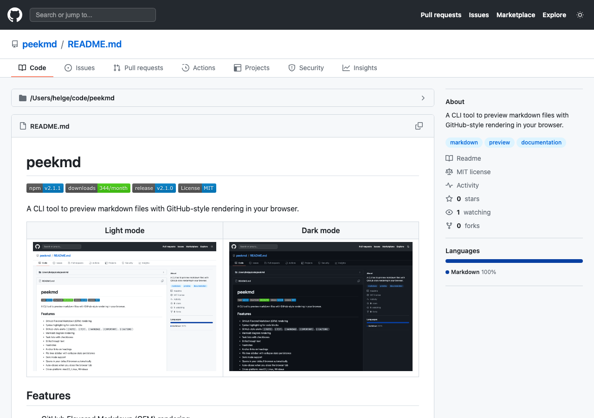
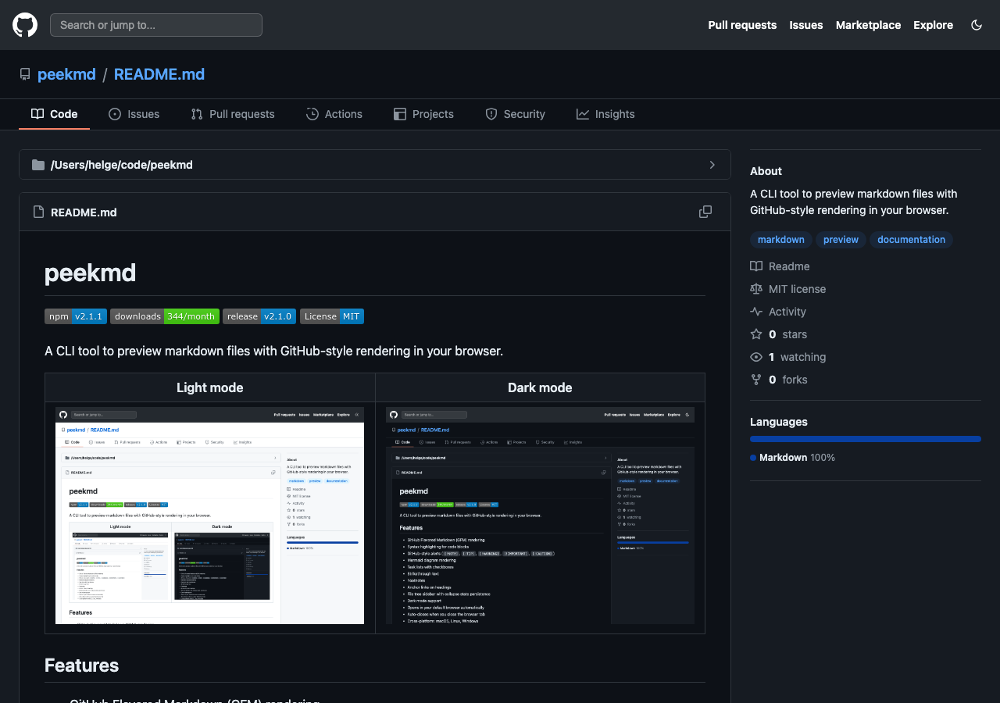

# peekmd

[](https://www.npmjs.com/package/peekmd)
[](https://www.npmjs.com/package/peekmd)
[](https://github.com/HelgeSverre/peekmd/releases)
[](https://opensource.org/licenses/MIT)

A CLI tool to preview markdown files with GitHub-style rendering in your browser.

| Light mode | Dark mode |
|---|---|
|  |  |

## Features

- GitHub Flavored Markdown (GFM) rendering
- Syntax highlighting for code blocks (50+ languages)
- GitHub-style alerts (`[!NOTE]`, `[!TIP]`, `[!WARNING]`, `[!IMPORTANT]`, `[!CAUTION]`)
- Mermaid diagram rendering (flowcharts, sequence diagrams, pie charts, etc.)
- Task lists with checkboxes
- Strikethrough text
- Footnotes
- Anchor links on headings
- File tree sidebar with collapse state persistence
- Copy raw markdown to clipboard
- Local image proxying (relative image paths just work)
- Dark mode with system preference detection
- Auto port selection when default port is in use
- Opens in your default browser automatically
- Auto-closes when you close the browser tab
- Cross-platform: macOS, Linux, Windows

## Requirements

**[Bun](https://bun.sh) is required** to run peekmd. Install it with:

```bash
curl -fsSL https://bun.sh/install | bash
```

## Installation

### Quick Run (no install)

```bash
# Using bunx (recommended)
bunx peekmd README.md

# Using npx (requires Bun in PATH)
npx peekmd README.md
```

### Global Installation

```bash
# Using bun (recommended)
bun install -g peekmd

# Using npm (requires Bun in PATH)
npm install -g peekmd
```

Then run from anywhere:

```bash
peekmd README.md
```

### Manual Installation (from source)

Clone the repository and choose one of the following approaches:

```bash
git clone https://github.com/HelgeSverre/peekmd.git
cd peekmd
bun install
```

#### Option A: Link for Development

This creates a symlink so you can run `peekmd` from anywhere. Requires Bun to be in your PATH.

```bash
bun link
```

Now you can run:

```bash
peekmd /path/to/file.md
```

To unlink later:

```bash
bun unlink peekmd
```

#### Option B: Build Standalone Binary

This creates a self-contained executable that works without Bun installed at runtime.

```bash
bun run compile
```

This creates a `peekmd` binary in the project directory. Move it to your PATH:

```bash
# macOS/Linux
sudo mv peekmd /usr/local/bin/

# Or add to your local bin
mv peekmd ~/.local/bin/
```

## Usage

```bash
# Preview a markdown file
peekmd README.md

# Preview any markdown file
peekmd docs/guide.md

# Preview with full path
peekmd /path/to/file.md

# Show version
peekmd --version
```

## How it works

1. Reads the markdown file and renders it to HTML using `markdown-it` with syntax highlighting, alerts, mermaid diagrams, and other GFM extensions
2. Generates a file tree from the current working directory (3 levels deep, max 20 items per level)
3. Extracts a description from the first paragraph after any heading
4. Wraps everything in a GitHub-style HTML template with header, navigation, sidebar, and file tree
5. Starts a local Bun server (default port 3456, auto-selects if in use) and opens the preview in your browser
6. Proxies relative image paths through the server so local images render correctly
7. Auto-closes the server when you close the browser tab

## Development

```bash
# Run in development mode (previews README.md)
bun run dev

# Format code
bun run format

# Build standalone binary
bun run compile
```

## Testing

```bash
# Run all unit tests
bun test

# Run tests with watch mode
bun test --watch

# Run tests with coverage
bun test --coverage

# Run visual regression tests
bun run test:visual

# Update visual baselines (after intentional UI changes)
bun run test:visual:update

# Run visual tests without GitHub gist comparison (faster)
bun run test:visual:local

# Manual testing with kitchen-sink file
bun run test:manual
```

Visual regression tests use Playwright to capture screenshots across multiple viewports (desktop, tablet, mobile) and color modes (light, dark), then compare against baseline images using pixelmatch.

## Troubleshooting

### "bun: command not found"

Bun is not installed or not in your PATH. Install it:

```bash
curl -fsSL https://bun.sh/install | bash
```

Then restart your terminal or run:

```bash
source ~/.bashrc  # or ~/.zshrc
```

### "ReferenceError: Bun is not defined"

You're running with Node.js instead of Bun. This can happen if:

- You installed an older version of peekmd
- The shebang is incorrect

Update to the latest version:

```bash
bun install -g peekmd@latest
```

Or if running from source, make sure `cli.ts` has `#!/usr/bin/env bun` as the first line.

## License

[MIT](LICENSE)
