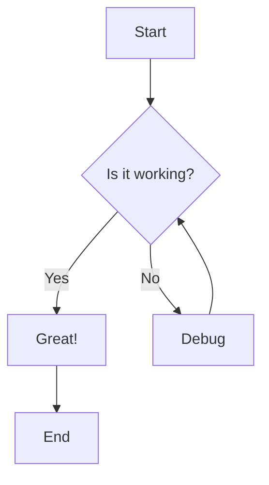
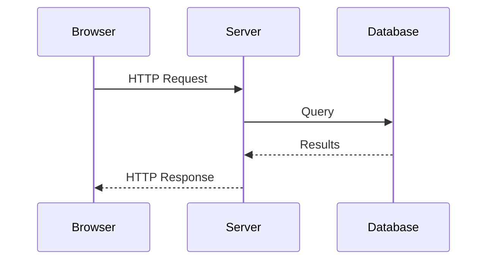
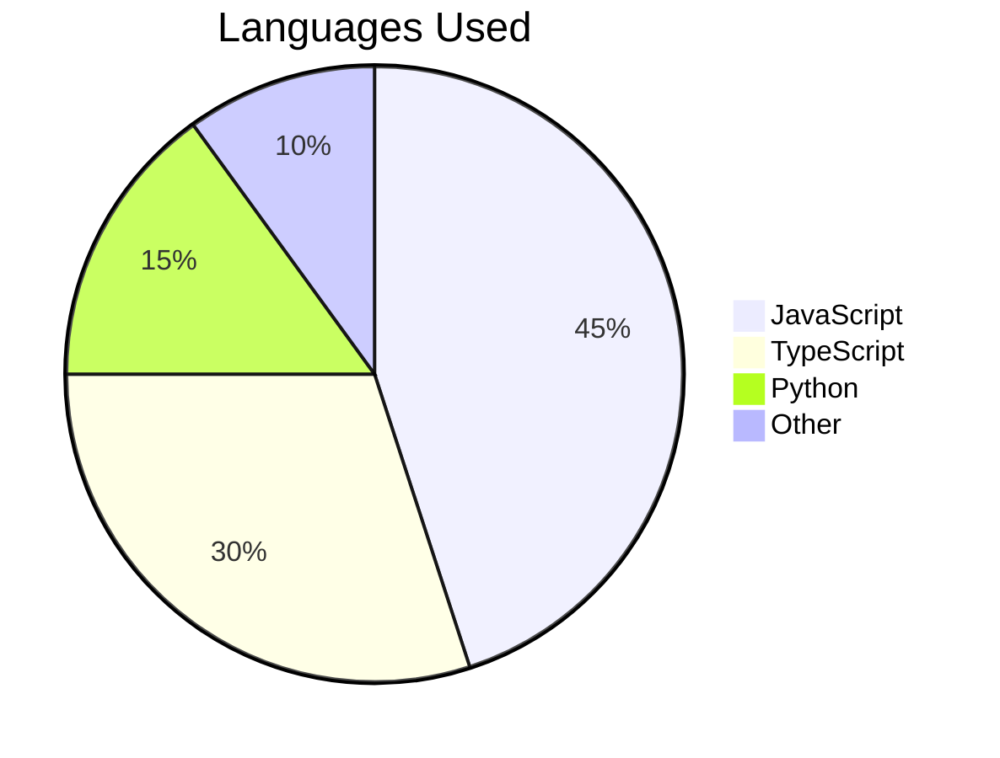

# Kitchen Sink - All Markdown Features

A comprehensive test file for all GitHub-flavored markdown features supported by peekmd.

## Text Formatting

Regular paragraph text with **bold**, _italic_, **_bold italic_**, and ~~strikethrough~~ text.

You can also use **bold** and _italic_ with underscores.

Inline `code` looks like this.

## Links and Images

- [Regular link](https://github.com)
- [Link with title](https://github.com "GitHub Homepage")
- Autolink: https://example.com
- Email autolink: contact@example.com

Images (these won't load, just testing syntax):


## Headings

# Heading 1

## Heading 2

### Heading 3

#### Heading 4

##### Heading 5

###### Heading 6

## Lists

### Unordered List

- Item 1
- Item 2
  - Nested item 2.1
  - Nested item 2.2
    - Deep nested 2.2.1
- Item 3

### Ordered List

1. First item
2. Second item
   1. Nested item 2.1
   2. Nested item 2.2
3. Third item

### Task Lists

- [x] Completed task
- [ ] Incomplete task
- [x] Another completed task
  - [ ] Nested incomplete
  - [x] Nested complete

## Blockquotes

> This is a blockquote.
> It can span multiple lines.

> Nested blockquotes:
>
> > This is nested
> >
> > > And even deeper

## GitHub Alerts

> [!NOTE]
> Useful information that users should know, even when skimming content.

> [!TIP]
> Helpful advice for doing things better or more easily.

> [!IMPORTANT]
> Key information users need to know to achieve their goal.

> [!WARNING]
> Urgent info that needs immediate user attention to avoid problems.

> [!CAUTION]
> Advises about risks or negative outcomes of certain actions.

## Code Blocks

### JavaScript

```javascript
function greet(name) {
  console.log(`Hello, ${name}!`);
  return true;
}

const result = greet("World");
```

### TypeScript

```typescript
interface User {
  id: number;
  name: string;
  email?: string;
}

function createUser(data: Partial<User>): User {
  return { id: Date.now(), name: "Anonymous", ...data };
}
```

### Python

```python
def fibonacci(n: int) -> list[int]:
    """Generate Fibonacci sequence up to n terms."""
    fib = [0, 1]
    for _ in range(2, n):
        fib.append(fib[-1] + fib[-2])
    return fib[:n]

print(fibonacci(10))
```

### Bash

```bash
#!/bin/bash
echo "Hello from bash!"
for i in {1..5}; do
    echo "Count: $i"
done
```

### JSON

```json
{
  "name": "peekmd",
  "version": "2.0.0",
  "dependencies": {
    "markdown-it": "^14.0.0"
  }
}
```

### Diff

```diff
- const old = "removed";
+ const new = "added";
  const unchanged = "same";
```

### Plain code block (no language)

```
This is a plain code block
with no syntax highlighting.
```

## Tables

### Simple Table

| Name    | Age | Role      |
| ------- | --- | --------- |
| Alice   | 30  | Developer |
| Bob     | 25  | Designer  |
| Charlie | 35  | Manager   |

### Aligned Table

| Left | Center | Right |
| :--- | :----: | ----: |
| L1   |   C1   |    R1 |
| L2   |   C2   |    R2 |
| L3   |   C3   |    R3 |

### Complex Table

| Feature  | Status     | Notes     |
| -------- | ---------- | --------- |
| **Bold** | `code`     | [link](#) |
| _Italic_ | ~~strike~~ | Normal    |

## Horizontal Rules

---

---

---

## Footnotes

Here's a sentence with a footnote[^1].

Another sentence with a different footnote[^bignote].

[^1]: This is a simple footnote.

[^bignote]: Here's one with multiple paragraphs and code.

    Indent paragraphs to include them in the footnote.

    `{ code }`

## HTML Elements (Inline)

<kbd>Ctrl</kbd> + <kbd>C</kbd> to copy.

<sub>subscript</sub> and <sup>superscript</sup>

<mark>Highlighted text</mark>

## Details/Summary (Collapsible)

<details>
<summary>Click to expand</summary>

This content is hidden by default.

- Hidden item 1
- Hidden item 2

```javascript
const hidden = "code";
```

</details>

<details open>
<summary>This one starts open</summary>

You can see this content immediately.

</details>

## Mermaid Diagrams

### Flowchart



### Sequence Diagram



### Pie Chart



## Edge Cases

### Empty Elements

-
- Non-empty item

### Special Characters

- Ampersand: &
- Less than: <
- Greater than: >
- Quote: "
- Apostrophe: '
- Backtick in code: `` `code` ``

### Long Content

This is a very long paragraph that should wrap properly in the preview. Lorem ipsum dolor sit amet, consectetur adipiscing elit. Sed do eiusmod tempor incididunt ut labore et dolore magna aliqua. Ut enim ad minim veniam, quis nostrud exercitation ullamco laboris nisi ut aliquip ex ea commodo consequat.

### Escape Characters

\*Not italic\*
\*\*Not bold\*\*
\[Not a link\](url)
\`Not code\`

---

_End of kitchen sink test file._
